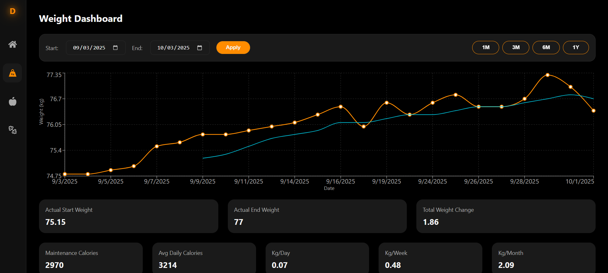
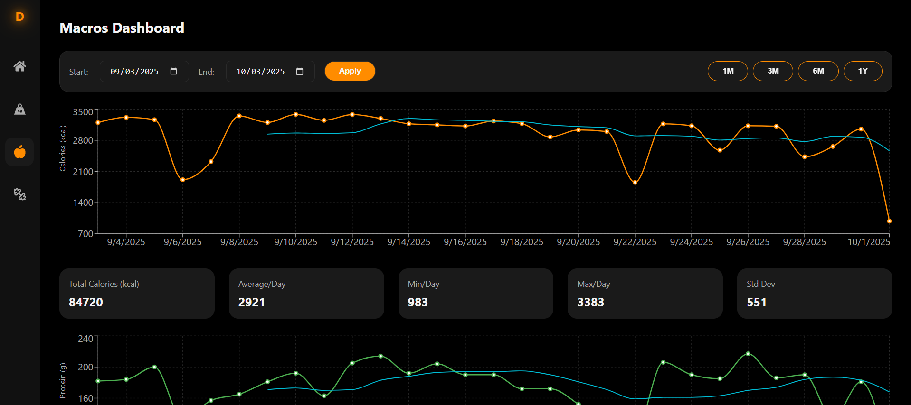
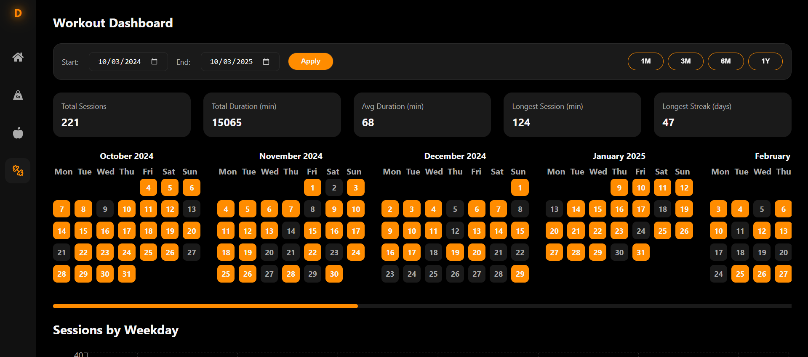

## THE Dashboard — Weight, Calories, Macros & Workouts, Investments, Expenses & Habits

Track your health metrics, investments, expenses, and habits in one place and easily import Apple Health data.





### Description

Personal Dashboard is a privacy‑first web app for visualizing your weight, calories, macronutrients, workouts, investments, expenses, and habit progress over time. It gives you a single, simple place to see trends, set targets, and stay consistent—without surrendering your data to third parties. You can import Apple Health data to backfill historical records quickly, track your Interactive Brokers (IBKR) investment portfolio, monitor bank transactions and spending patterns, and log progress on skills you're mastering. Everything is self‑hosted and stored locally in SQLite.

Key goals:

- Keep your data local and portable (SQLite by default)
- Fast, frictionless viewing of trends and summaries
- Easy import of Apple Health data (weight, workouts, dietary intake)
- Comprehensive investment tracking from Interactive Brokers
- Detailed expense analysis and budgeting insights
- Habit and skill mastery progress tracking

---

### Features

- **Unified Dashboard**: View weight, calories, macros, workout, investment, expense, and habit summaries.
- **Apple Health Import**: Upload your Health export XML to backfill data.
- **Weight Trends**: Daily averages and moving averages (7/30/90‑day windows).
- **Macros & Calories**: Per‑day totals, moving averages, and period summaries.
- **Workout Analytics**: Session counts, durations, weekly/monthly breakdowns, and streaks.
- **Investment Portfolio**: Track Interactive Brokers positions, P/L, growth charts, and Monte Carlo simulations.
- **Expense Tracking**: Import bank statements, categorize transactions, analyze spending patterns.
- **Wallet Analytics**: Cash flow charts, top spending categories, recurring transactions, and budgeting insights.
- **Mastery & Habits**: Log hours on skills/activities, set goals, track progress with visual indicators.
- **Monte Carlo Simulations**: Forecast investment portfolio growth with customizable parameters.
- **Maintenance Estimator**: Estimate maintenance calories from weight trend vs calorie intake.
- **Local Storage**: SQLite database created and managed automatically.
- **Responsive UI**: Vite + React frontend; charts via Recharts.

---

### Tech Stack

- **Backend**: FastAPI (Python 3.11), Uvicorn
- **Parsing & Analytics**: pandas, numpy, scikit‑learn
- **Database**: SQLite (file at `backend/app/db/db.sqlite3`)
- **Frontend**: React + TypeScript + Vite, Recharts, React Router
- **Containers**: Dockerfiles for backend and frontend + Docker Compose

Minimum recommended versions:

- Python 3.11+
- Node.js 18+ (or 20+)

---

### Installation

Prerequisites:

- Python 3.11+
- Node.js 18+
- Git

Clone the repository:

```bash
git clone https://github.com/tudormatei/personal-dashboard
cd personal-dashboard
```

Run the development server:

```bash
npm run dev
```

Run the production server:

```bash
npm run build
```

Open the dashboard at `http://localhost`

---

### Usage

1. Import Apple Health data

- On iPhone: Health app → Profile → Export All Health Data → save `export.zip`.
- Send `export.zip` to your computer and unzip to get `export.xml` (or keep as XML inside zip if you prefer extracting the XML only).
- Use the API endpoint below to upload the XML. A simple UI upload may exist in the frontend; otherwise, use `curl`.

2. Import Investment Data from Interactive Brokers

- Populate `.env` with your personal Flex query token and specific query ID.
- Setup Flex statement in IBKR interface.
- View portfolio positions, P/L, growth charts, and run Monte Carlo simulations.

3. Import Bank Transactions for Expense Tracking

- Export transactions from your bank as CSV/Excel.
- Upload via the Upload page or API endpoint.
- Categorize transactions, analyze spending patterns, and track recurring expenses.

4. Track Habits and Skills

- Add activities you want to master (e.g., Guitar, Coding).
- Set goal hours and log progress daily.
- Monitor progress bars and total logged hours.

5. Explore charts and summaries in the frontend

- The React app (Vite) uses Recharts for interactive graphs.
- Weight and macro views support 7/30/90‑day moving averages.
- Investments include portfolio allocation, growth charts, and Monte Carlo projections.
- Wallet provides cash flow analysis, spending breakdowns, and transaction filtering.
- Mastery shows progress bars and activity logging.
- Frontend typescript types are synced to the backend python models by running `npm run sync`

6. Data storage

- The backend stores imported data in `backend/app/db/db.sqlite3`.
- Re‑importing replaces previous `health_records`, `workouts`, `investments`, `bank_transactions`, and `mastery_activities` tables with fresh data.
